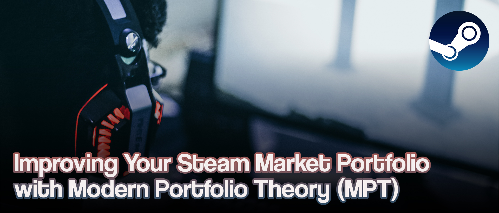
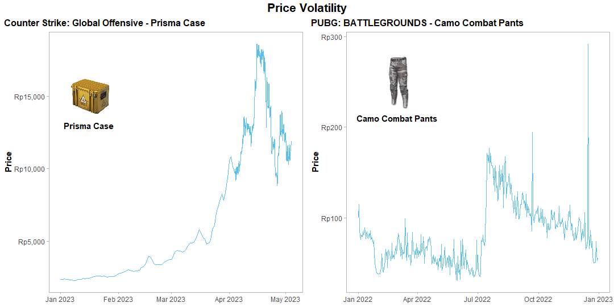
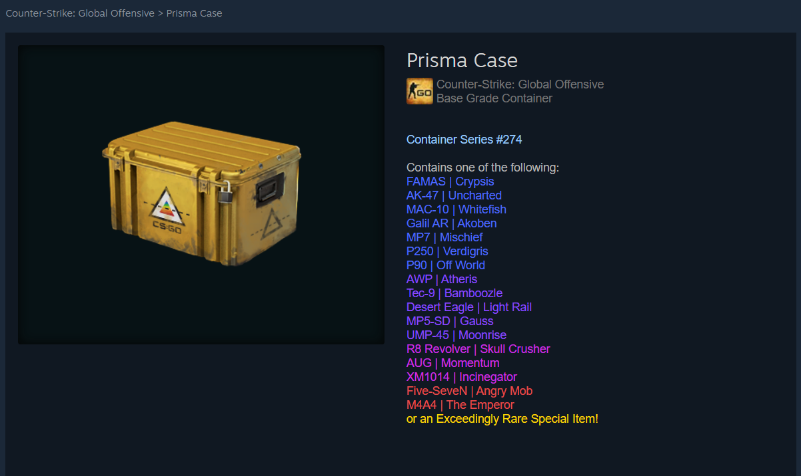
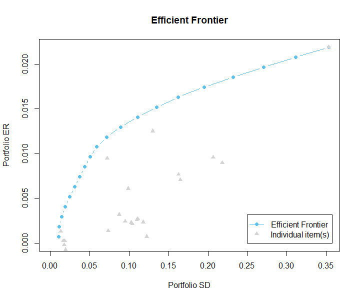
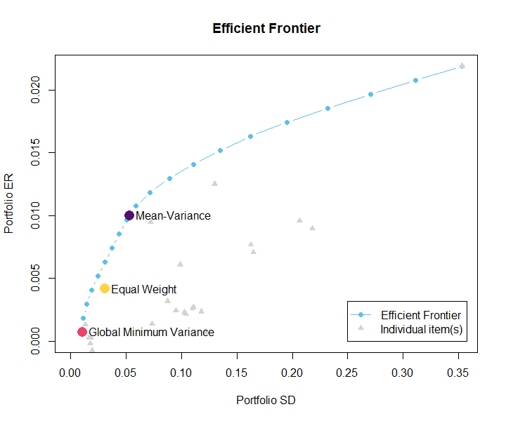

# Improving Your Steam Market Portfolio with Modern Portfolio Theory (MPT)

*Illustration asset by [Fredrick Tendong](https://unsplash.com/@frdx?utm_source=unsplash&utm_medium=referral&utm_content=creditCopyText) on [Unsplash](https://unsplash.com/photos/6ou8gWpS9ns?utm_source=unsplash&utm_medium=referral&utm_content=creditCopyText)*

## Table of Content

* [What is Steam Market?](#what-is-steam-market)
    + [Commodities and their characteristics](#commodities-and-their-characteristics)
    + [Price volatility](#price-volatility)
* [Financial Portfolio](#financial-portfolio)
    + [Why asset diversification matters](#why-asset-diversification-matters)
    + [What makes a “good” financial portfolio](#what-makes-a-good-financial-portfolio)
* [Modern Portfolio Theory](#modern-portfolio-theory)
    + [Efficient Frontier](#efficient-frontier)
    + [Global Minimum Variance portfolio](#global-minimum-variance-portfolio)
    + [Mean-Variance Efficient portfolio](#mean-variance-efficient-portfolio)
* [Optimizing Steam Market Portfolio](#optimizing-steam-market-portfolio)
    + [Historical price data](#historical-price-data)
    + [Asset pre-selection](#asset-pre-selection)
    + [Efficient Frontier chart](#efficient-frontier-chart)
    + [Comparison summary](#comparison-summary)
    + [Final result](#final-result)
* [Closing Thoughts](#closing-thoughts)
* [References](#references)

---

## What is Steam Market?

Steam Market is an online marketplace of the popular gaming platform, Steam, which is run by Valve Corporation. Steam Market allows it users to sell and buy virtual goods for Steam’s games. To buy things in the Steam Market, you need a special type of money called Steam Wallet funds, which you can add to your account using a credit card or other payment method. When someone buys something in the Steam Market, the person who sells it gets some of the Steam Wallet funds, and [Valve](https://www.valvesoftware.com/en/), the company that runs the Steam platform, takes a small part of the money as a fee.

### Commodities and their characteristics

There are various items that are sold in the Steam Market. I do not know how many total items that are listed there, but the items can be categorized into several groups.

1. **In-game items**: items that are usable in specific games, such as weapons, skins, hats, and other cosmetics. Popular games that offer many tradeable in-game items are Counter-Strike: Global Offensive (CSGO), Dota 2, and Team Fortress 2
2. **Trading cards**: Steam Trading Cards are collectible items that players can earn by playing certain games
3. **Emoticons and backgrounds**: cosmetics to improve users’ experiences
4. **Other**: other types of items that did not mention above

Items sold in the Steam Market can be considered liquid assets, as they can be bought and sold quickly and easily with minimal transaction fees. However, the liquidity of specific items can be affected by various factors, such as changes in the game's popularity or updates that make certain items less desirable. In general, items that are in high demand and have a large trading volume tend to be more liquid than less popular or rare items.

### Price volatility

As an open marketplace, items that are sold in the Steam Market are determined by supply and demand, as well as the perceived rarity and value of the items. Most of the items’ prices tend to decline over time, but for certain items, their prices can fluctuate rapidly.

There are varieties of factors that may influence item prices, such as the game itself and also the players’ behavior. It is worth noting that the price of certain items can be quite volatile, thus users can take advantage of it.

## Financial Portfolio

[Investopedia](https://www.investopedia.com/terms/p/portfolio.asp)’s definition of financial portfolio:

> A portfolio is a collection of financial investments like stocks, bonds, commodities, cash, and cash equivalents, including closed-end funds and exchange traded funds (ETFs).
> 

The assets that are included in a portfolio are called asset classes. A portfolio can be made purely out of a single asset class or a mix of different asset classes, this is called diversification. 

### Why asset diversification matters

Diversification matters because it can help reduce the overall risk of the investments. It seeks to optimize profits by investing in many regions that might react differently to the same occurrence. There are several methods to diversify, how you go is up to you. Your future financial objectives, risk tolerance, and personality all play a role in determining how to construct your portfolio.

### What makes a “good” financial portfolio

A "good" portfolio is one that is well-diversified, constructed with an investor's risk tolerance in mind, and is monitored and rebalanced on a regular basis to ensure that it fits the investor's objectives. Investors may design portfolios that are tailored to fulfill their financial goals and achieve long-term investing success by adhering to these guidelines.

## Modern Portfolio Theory

The Modern Portfolio Theory (MPT) is a framework for designing an optimal investment portfolio by balancing the portfolio's projected return and risk. MPT, which was created by economist Harry Markowitz in the 1950s, contends that rather than concentrating just on individual stocks or bonds, investors may maximize their portfolios by choosing a variety of assets with varied levels of risk [2]. The notion of efficient portfolios is central to MPT. An efficient portfolio is one that has been designed to give the optimum risk-return trade-off possible. MPT also emphasizes the importance of diversification and selecting assets that have low correlations with each other to help reduce overall portfolio risk.

### Efficient Frontier

The Efficient Frontier is a graphical depiction of Modern Portfolio Theory (MPT) that depicts the set of optimum portfolios with the highest predicted return for a given level of risk or the lowest feasible risk for a given level of return. In other words, it is the limit of feasible portfolios that provides the optimal risk-return trade-off.

](asset/Efficient-Frontier-illust.jpg)

Illustration by [Finance Train](https://financetrain.com/the-minimum-variance-frontier-efficient-frontier)

Efficient Frontier is created by plotting the expected return on the y-axis and the level of risk (typically measured by standard deviation) on the x-axis for plenty of portfolios composed of varying mixes of risky and risk-free assets. Portfolios on the Efficient Frontier are the most efficient because they offer the highest expected return for a given level of risk or the lowest potential risk for a given level of return.

With Efficient Frontier, you may increase your profits by taking on more risk, but you can also lower risk by diversifying your portfolio across numerous assets. The Efficient Frontier is an important part of MPT since it gives a visual depiction of the theory's main ideas and assists investors in building portfolios that are optimal for risk and return.

### Global Minimum Variance portfolio

The Global Minimum Variance is a technique to create a portfolio with the lowest possible variance, or risk. On the Efficient Frontier, the Global Minimum Variance portfolio is depicted as the leftmost point, meaning the lowest likely risk portfolio. This technique minimizes the portfolio’s risk while maintaining the sum of its assets’ weight is equal to 1.

Let $r_i$ be the random variable associated with the rate of return for asset $i$, for $i=1,2,...,n$, and define the random vector

$$
z=(r_1,r_2,...,r_n)^T
$$

Then, set

$$
\mu_i=\mathbb{E}[r_i]\\
m=(\mu_1,\mu_2,...,\mu_n)^T\\
cov(z)=\Sigma
$$

If

$$
w=(w_1,w_2,...,w_n)^T
$$

is a set of weights associated with a portfolio, then the rate of return of this portfolio

$$
r=\Sigma_{i=1}^{n}r_iw_i
$$

is also a random variable with mean $m^Tw$ and variance $w^T\Sigma w$.

The Global Minimum Variance technique tries to

$$
\displaylines{
\text{minimize}\ \ \ \frac{1}{2}w^T\Sigma w \\
\text{subject to}\ \ \ \text{e}^Tw=1
}
$$

where $\text{e}$ denotes a vector of ones.

Assuming $\Sigma$ is invertible, the set of weight that minimizes risk of portfolio is

$$
w_{\text{GlobalMinVar}}=\frac{\Sigma^{-1}\text{e}}{\text{e}^T\Sigma^{-1}\text{e}}
$$

### Mean-Variance Efficient portfolio

The Mean-Variance Efficient is a technique to create a portfolio with the lowest possible risk for certain expected returns. This technique is similar to Global Minimum Variance but in addition to seek a particular value of an expected return $(r_0)$.

$$
\displaylines{
\text{minimize}\ \ \ \frac{1}{2}w^T\Sigma w \\
\text{subject to}\ w^Tr=r_0\ \text{and}\ \text{e}^Tw=1
}
$$

The solution for this minimization problem is a little bit more complex, hence I suggest the reader seek it by themselves in [3] and [4].

## Optimizing Steam Market Portfolio

The main goal is to obtain a set of individual assets, and their correspondence portfolio weight, which optimizes the expected return of a “Steam” market portfolio. The term individual asset refers to a single item from any game. For instance, [Prisma Case](https://steamcommunity.com/market/listings/730/Prisma%20Case) from Counter-Strike: Global Offensive is an individual asset.

### Historical price data

Using Steam's API service, I collected the historical price data of certain items from certain games. The scouted items are the top 10 items with the highest volume of transactions recently (or at the time I collected the data) from these popular games:

| app id | name |
| --- | --- |
| 730 | Counter Strike: Global Offensive |
| 440 | Team Fortress 2 |
| 570 | Dota 2 |
| 578080 | PUBG: BATTLEGROUNDS |
| 252490 | Rust |

The `app id` is a Steam unique identifier for the game. So, I collected the historical data for 50 items or individual assets. The data range varies because of the difference in each item's release date. You can find the data at my GitHub page.

### Asset pre-selection

To start, I filtered out some assets to eliminate “bad” result possibilities. Based on the date of observation, I truncated all data that are older than 2018. The reason for this is that the older the data, the more likely it contains missing values. Afterward, I kept the assets with their individual risk not greater than 30%. *You don’t want to keep risky assets, do you?*

### Efficient Frontier chart

Using `IntroCompFinR` library made by Eric Zivot, the work can be done easily.

The illustration above is the Efficient Frontier chart for the pre-selected assets. The blue dot-line is the simulated efficient frontier line, and the grey triangles denoted individual assets. The x-axis is portfolio’s risk while the y-axis is portfolio’s expected rate of return.

### Comparison summary

| Method | Expected Return | Risk |
| --- | --- | --- |
| Equal Weighting | 0.417% | 3.049% |
| Global Minimum Variance | 0.071% | 1.031% |
| Mean-Variance Efficient | 1.000% | 5.284% |

I compared three approaches to seek the optimized weighting for the portfolio. The equal weighting method is an addition to the two theoretical methods discussed above. It simply assigned equal weight to each individual asset just like the method’s name, literally. For the Mean-Variance Efficient method, I set the return target to 1%. 

To have a clear view of each method positioning in the Efficient Frontier chart, take a look at the picture below.

As you can see, the Global Minimum Variance and Mean-Variance Efficient are on the efficient frontier line, thus both of them are the optimum portfolio that follows the MPT. On the other hand, the Equal Weighting method does not lie on the efficient frontier line, which makes that method worse than the other two.

### Final result

*So, what to choose?*

The answer is left to you, the reader. Which type of investor are you? How much risk you can bear? If you are a risk seeker, the Mean-Variance Efficient method is acceptable. With around 5% of risk, you can expect to get 1% of return from your portfolio. On the other side, if you are risk-averse, then Global Minimum Variance is the right choice for you. Although it only expects a yield of 0.071%, the risk is also at a minimum around 1%.

## Closing Thoughts

Being a gamer does not always mean being a money spender. Steam Market allows them to build financial portfolios which lead to an income, and eventually moneymaker! Since items that are sold there can be considered liquid assets, there are vast options for its user to build their portfolios. To improve the portfolio design, Modern Portfolio Theory is expected to help. Using Efficient Frontier, we can visualize the positioning of an efficient portfolio design. Furthermore, using the Global Minimum Variance and Mean-Variance method, we can find the optimal risk-return trade-off portfolio design. Finally, which design is fit for a specific individual is depend on the individual itself.

*Combining theoretical financial knowledge with a hobby is entertaining, isn’t it?* 😀

---

## References

[1] A. Hayes. “Portfolio Variance: Definition, Formula, Calculation, and Example.” Investopedia. Feb. 24, 2022. [https://www.investopedia.com/terms/p/portfolio-variance.asp](https://www.investopedia.com/terms/p/portfolio-variance.asp) (accessed: May 07, 2023).

[2] “Harry Markowitz’s Modern Portfolio Theory: The Efficient Frontier.” GuidedChoice. Jul. 08, 2017. [https://www.guidedchoice.com/video/dr-harry-markowitz-father-of-modern-portfolio-theory/](https://www.guidedchoice.com/video/dr-harry-markowitz-father-of-modern-portfolio-theory/) (accessed: May 07, 2023).

[3] J. V. Burke, *Markowitz Mean-Variance Portfolio Theory*. Department of Mathematics of University of Washington, 2020. [Online]. Academic Material.

[4] E. Zivot, *Introduction to Computational Finance and Financial Econometrics with R*. Seattle, Washington, Jun. 01, 2021. [Online]. E-Book.
